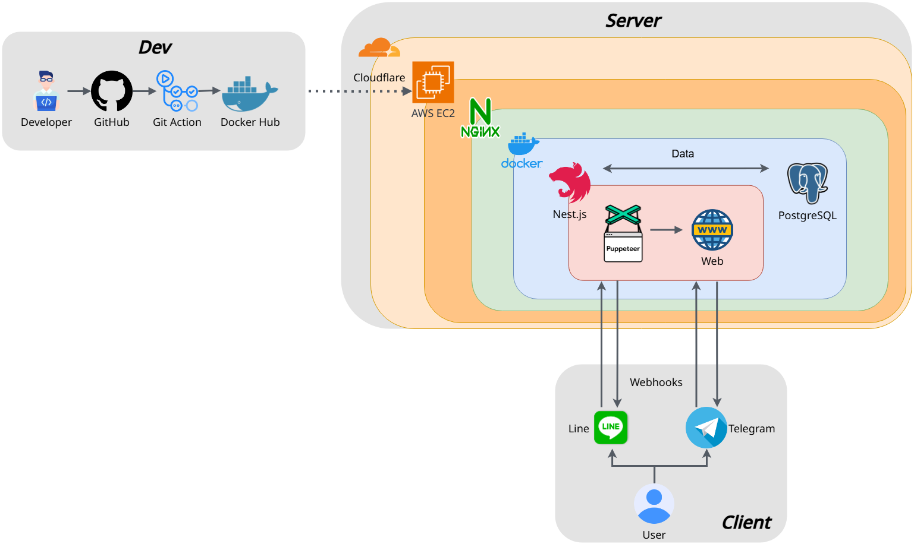

# 台股查詢機器人 🤖

一個基於 Telegram 及 Line 平台的台股資訊查詢機器人，提供即時股價、K線圖表、新聞、訂閱股票資訊等功能。

## 💻 Demo (架設於免費平台，功能可能不完整)

```cmd
https://t.me/Tian_Stock_bot
```

## 🚀 快速開始

### 使用步驟
1. Clone 專案
2. 設定 `.env.example` 中的參數，並將檔名改為`.env`
3. 在`docker-compose`目錄底下執行指令 `docker compose up` (本機需先安裝 🐳 docker)
4. 開始使用 !

## 💡 功能特色

### 🔑 核心功能
- 即時股價查詢
- 技術分析圖表
- 個股新聞追蹤
- 績效資訊查看
- 多時間週期K線圖
- 定時推播股票資訊

### 🛠️ 採用技術
- ⚡  Nest.js + Postgre SQL
- 🤖 整合 Telegram 及 Line Bot 多平台支援
- 🕷️ Puppeteer 爬蟲技術
- 🐳 Docker 容器化部署
- 🔄 GitHub Actions CI/CD 自動部屬
- ☁️ AWS EC2 雲端平台

### 🛡️ 額外技術
- 健康檢查機制 (HealthChecks)
- 回應壓縮 (Response Compression)

## 🔧 系統架構



## 📖 使用指南

  *K線圖表指令*

  *📊 基本K線圖*
  格式：`/k [股票代碼] [時間範圍]`

  時間範圍選項（預設：d）：
  - `h` - 時K線
  - `d` - 日K線 
  - `w` - 週K線
  - `m` - 月K線
  - `5m` - 5分K線
  - `15m` - 15分K線
  - `30m` - 30分K線
  - `60m` - 60分K線

  *股票資訊指令*
  - `/d [股票代碼]` - 查詢股票詳細資訊
  - `/p [股票代碼]` - 查詢股票績效
  - `/n [股票代碼]` - 查詢股票新聞
  - `/yn [股票代碼]` - 查詢Yahoo股票新聞（預設：台股新聞）
  - `/i [股票代碼]` - 查詢當日收盤資訊

  *市場總覽指令*
  - `/m` - 查詢大盤資訊
  - `/t` - 查詢當日交易量前20名

  *訂閱股票資訊*
  - `/add [股票代碼]` - 訂閱 股票
  - `/del [股票代碼]` - 取消訂閱 股票
  - `/sub 1` - 訂閱 當日個股資訊
  - `/sub 2` - 訂閱 觀察清單新聞
  - `/sub 3` - 訂閱 當日市場成交行情
  - `/sub 4` - 訂閱 當日交易量前20名
  -  (取消訂閱 unsub + 代號)
  - `/list ` - 查詢已訂閱功能及股票

## 🚨 已知問題
- Tell me

## 📝 開發計劃
- [ ] 股價到價通知
- [ ] 新增美股市場

## 🤝 貢獻指南
歡迎提交 Issue 和 Pull Request 來協助改善專案！

## 專案狀態

